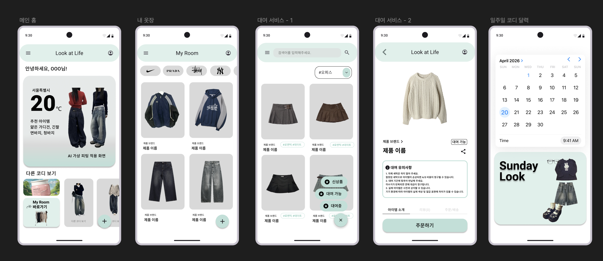
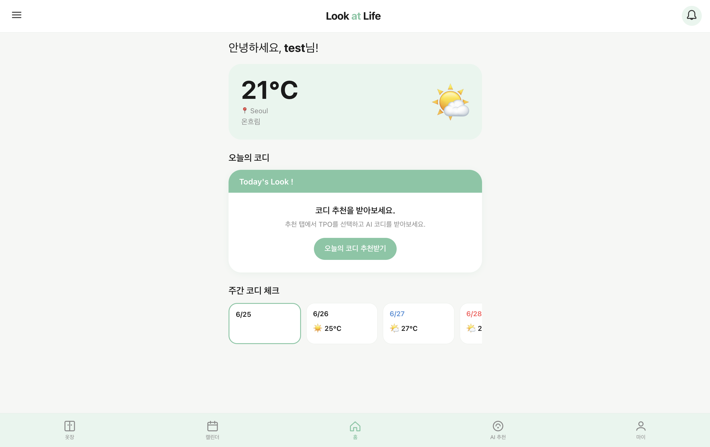
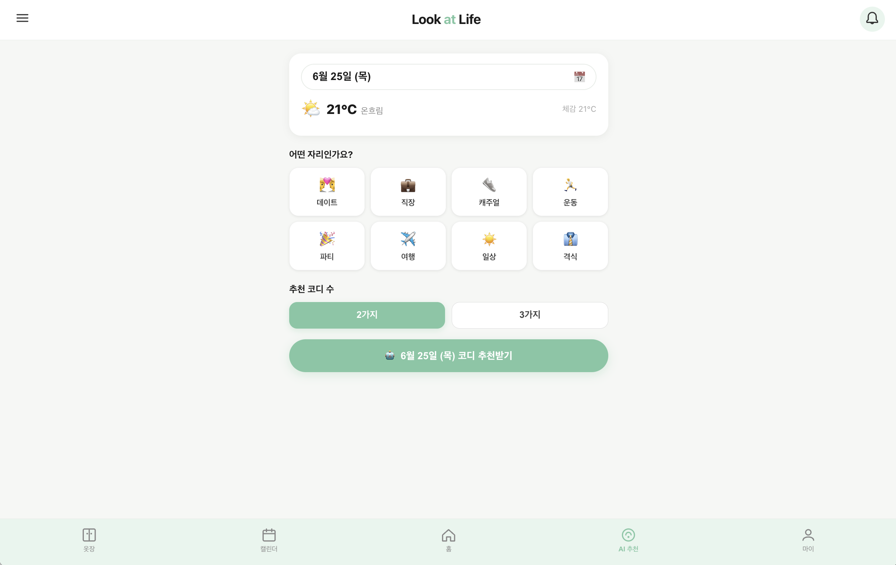
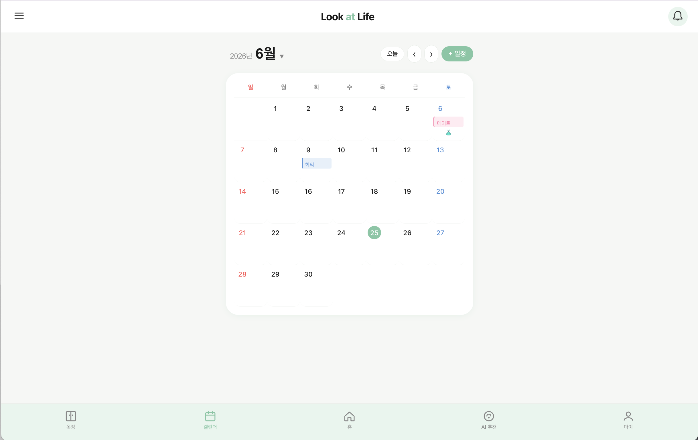
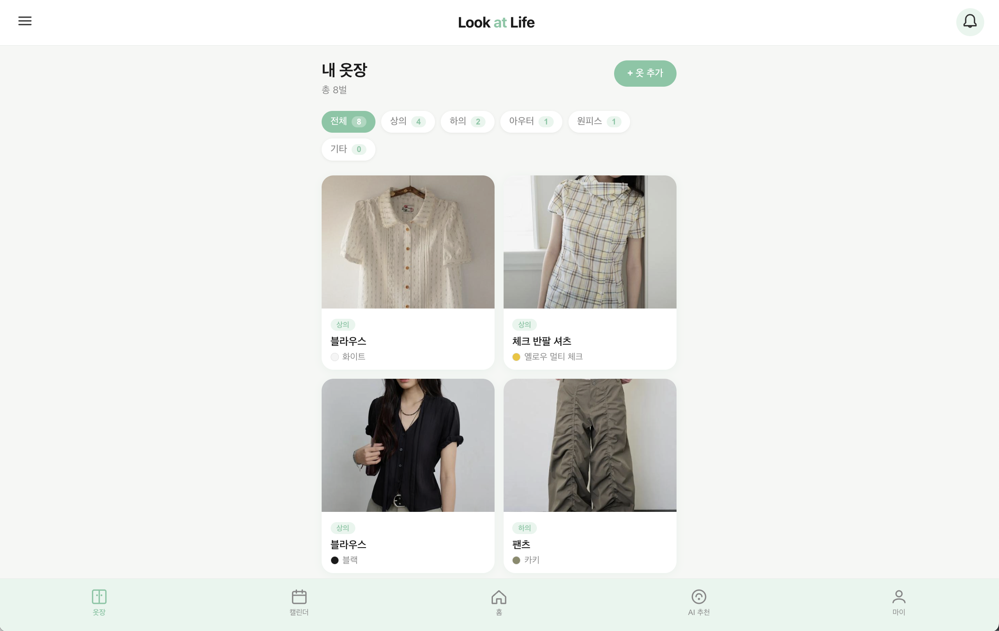
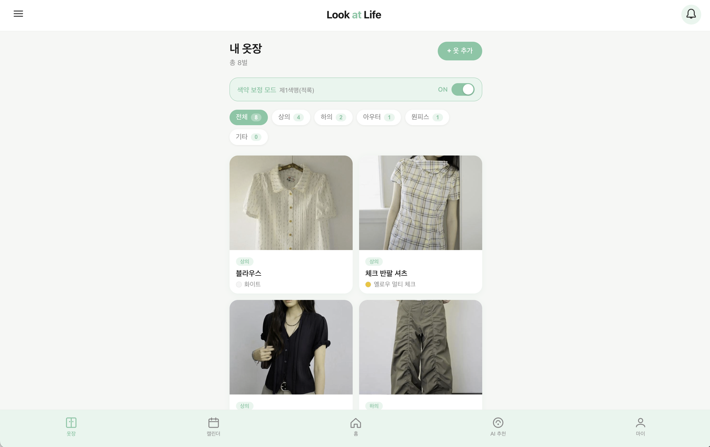
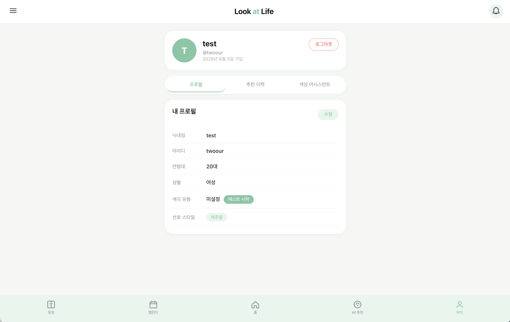

# Look at Life

## 서비스 화면

### 초기 디자인


### 메인 화면


### AI 추천 화면


### 캘린더 화면


### 옷장 화면


### 색약 보정 화면


### 마이페이지 화면


## 프로젝트 소개
사용자의 옷장을 관리하고 날씨 및 일정 기반으로 코디를 추천하는 웹 서비스입니다.

OpenWeather API를 활용하여 날씨 정보를 제공하고, AI 서버를 통해 Gemini, CLIP, DINOv2 및 Score Fusion 모델을 활용하여 사용자의 보유 의류와 날씨를 고려한 코디 추천 기능을 제공합니다.

색약 사용자의 접근성을 고려하여 색각 보정 기능을 추가하였습니다.

## 개발 기간
2026.01 ~ 2026.06 (팀 프로젝트)

## 팀 구성
- 4인 팀 프로젝트
- 서비스 초기 기획 및 앱 디자인 담당
- 프론트엔드 개발 공동 참여 (화면 구현 및 기능 개발)

## 담당 역할
- 서비스 초기 기획 및 화면 디자인 설계
- React를 활용한 화면 구현
- 옷장 조회 및 관리 기능 구현
- 캘린더 기반 일정 관리 기능 구현
- 공통 컴포넌트(Navbar 등) 개발
- OpenWeather API를 활용한 날씨 정보 표시 기능 구현
- AI 서버 연동을 통한 코디 추천 결과 화면 구현
- 색각 보정 기능 구현
- Git을 활용한 팀 협업

## 사용 기술

### Frontend
- React
- JavaScript
- CSS

### Library
- React Router DOM
- Axios

### API 및 AI
- OpenWeather API
- Gemini API
- CLIP
- DINOv2
- Score Fusion

### Tools
- Git
- GitHub

## 프로젝트 구조

```text
src/
├── api/
├── components/
├── pages/
├── styles/
├── App.js
├── index.js
└── daltonization.js
```

## 실행 방법

```bash
npm install
npm start
```

## 느낀 점

학교 팀 프로젝트를 진행하며 React 기반 프론트엔드 개발 경험을 쌓고, 외부 API 및 AI 서버를 연동하는 과정을 경험할 수 있었습니다.

단순히 프로젝트를 완성하는 것에 그치지 않고, 실제 서비스로 운영된다면 어떤 기능을 추가하고 개선할 수 있을지 확장성 측면에서 고민해 볼 수 있는 기회가 되었습니다.

또한 서비스 기획과 UI/UX 설계 과정에 참여하며 사용자 관점에서 기능을 설계하는 경험을 쌓았으며, 팀원들과 협업하며 개발을 진행하는 과정에서 원활한 의사소통과 협업의 중요성을 배울 수 있었습니다.